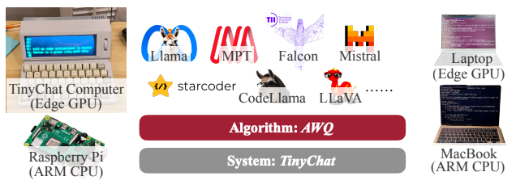

&nbsp;

Hi! I am Shang Yang, a first-year Ph.D. student at [HAN LAB](https://hanlab.mit.edu/) of [MIT EECS](https://eecs.mit.edu/), advised by [Prof. Song Han](https://songhan.mit.edu/). Before that, I received my Bachelor degree with highest honor from the [Department of Electronic Engineering](https://www.ee.tsinghua.edu.cn/en/), Tsinghua University, China, where I was fortunate to be advised by [Prof. Yu Wang](https://nicsefc.ee.tsinghua.edu.cn/people/YuWang).

My long-term goal is to build efficient machine learning systems for applications/workloads at different scales, such as Point Clouds and LLMs. Recently, I am activately working on the quantization of LLMs.

Please check my CV [here](https://ys-2020.github.io/files/CV_Shang_Yang.pdf)!

&nbsp;
&nbsp;

Selected Publications
======

&emsp;[**AWQ: Activation-aware Weight Quantization for On-Device LLM Compression and Acceleration**](https://arxiv.org/abs/2306.00978)  
Ji Lin\*, Jiaming Tang\*, Haotian Tang$^\dagger$, **Shang Yang$^\dagger$**, Wei-Ming Chen, Wei-Chen Wang, Guangxuan Xiao, Xingyu Dang, Chuang Gan, Song Han.
 
Accepted by *MLSys*, 2024.  

[**TorchSparse++: Efficient Training and Inference Framework for Sparse Convolution on GPUs**](https://dl.acm.org/doi/abs/10.1145/3613424.3614303)  
Haotian Tang\*, **Shang Yang\***, Zhijian Liu, Ke Hong, Zhongming Yu, Xiuyu Li, Guohao Dai, Yu Wang, Song Han.
 
Accepted by *MICRO*, 2023.  

[**Heuristic Adaptability to Input Dynamics for SpMM on GPUs**](https://arxiv.org/abs/2202.08556)  
Guohao Dai, Guyue Huang, **Shang Yang**, Zhongming Yu, Hengrui Zhang, Yufei Ding, Yuan Xie, Huazhong Yang, Yu Wang.
 
Accepted by *DAC*, 2022. **Best Paper Award Nominee (Top 6 in all 223 accepted papers).**  

&nbsp;
&nbsp;

Blogs
======

[**TinyChat: Large Language Model on the Edge**](https://hanlab.mit.edu/blog/tinychat)  

[**TinyChat: Visual Language Models & Edge AI 2.0**](https://hanlab.mit.edu/blog/tinychat-vlm)  

&nbsp;
&nbsp;

Education
======

&emsp;[MIT](https://www.mit.edu/)&ensp;&ensp;&ensp;&ensp;&ensp;&ensp;&ensp;&ensp;&ensp;&ensp;&ensp;&ensp;&ensp;&ensp;&ensp;&ensp;&ensp;&ensp;&ensp;&ensp;&ensp;&ensp;&ensp;&ensp;&ensp;&ensp;&ensp;&ensp;&ensp;&ensp;&ensp;&ensp;&ensp;Since 09/2023 &emsp;Ph.D. Student at [MIT EECS](https://eecs.mit.edu/) &emsp;Advised by Prof. [Song Han](https://songhan.mit.edu/)

&emsp;[Tsinghua University](https://www.tsinghua.edu.cn/en/)&ensp;&ensp;&ensp;&ensp;&ensp;&ensp;&ensp;&ensp;&ensp;&ensp;&ensp;&ensp;&ensp;&ensp;&ensp;&ensp;08/2019 - 07/2023   &emsp;Overall GPA: 3.99/4.0, Rank: 1/256  &emsp;B.Eng. in Electronic Information Science and Technology

&nbsp;
&nbsp;

Research Experiences
======

&emsp;[MIT](https://www.mit.edu/)&ensp;&ensp;&ensp;&ensp;&ensp;&ensp;&ensp;&ensp;&ensp;&ensp;&ensp;&ensp;&ensp;&ensp;&ensp;&ensp;&ensp;&ensp;&ensp;&ensp;&ensp;&ensp;&ensp;&ensp;&ensp;&ensp;&ensp;&ensp;07/2022 - 08/2023 &emsp;Research Intern at [HAN Lab](https://hanlab.mit.edu/), advised by Prof. [Song Han](https://songhan.mit.edu/)

&emsp;[Tsinghua University](https://www.tsinghua.edu.cn/en/)&ensp;&ensp;&ensp;&ensp;&ensp;&ensp;&ensp;&ensp;&ensp;&ensp;&ensp;&ensp;&ensp;&ensp;&ensp;10/2020 - 07/2023  &emsp;Undergraduate at [NICS-EFC](https://nicsefc.ee.tsinghua.edu.cn), advised by Prof. [Yu Wang](https://nicsefc.ee.tsinghua.edu.cn/people/YuWang)
